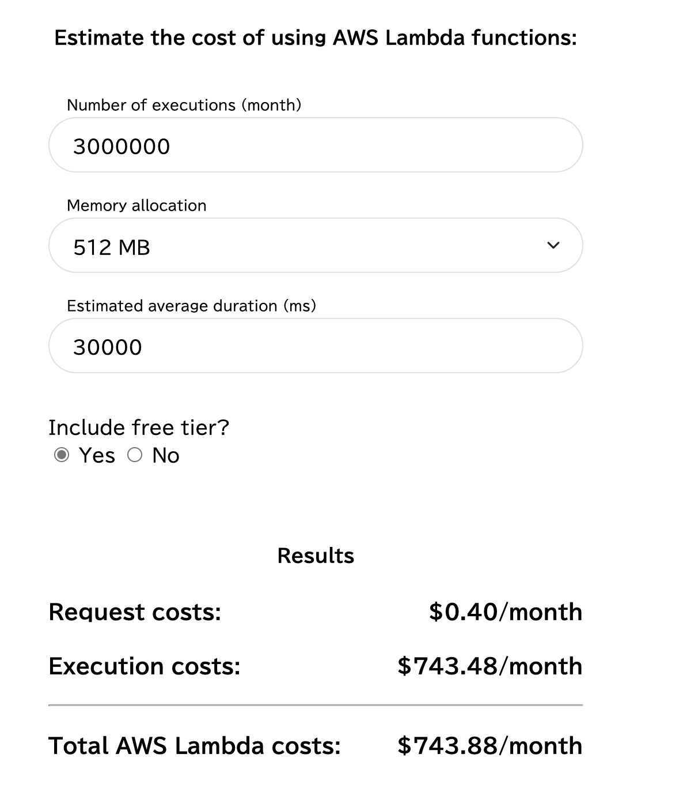

# Design Overview - AWS Lambda vs VM Cost Simulator

## プロジェクトの目的

このプログラムは、AWS Lambdaのコストと複数のクラウドプロバイダーのバーチャルマシンで同様のことを行う場合のコストを比較する**包括的なクラウドコスト管理プラットフォーム**です。

### 主要な価値提供
- **6つのクラウドプロバイダー**での正確なコスト比較
- **高度な分析機能**による最適化提案
- **リアルタイム料金取得**で常に最新の料金で計算
- **マルチリージョン対応**でグローバル展開をサポート
- **自動化機能**による継続的なコスト最適化

### 対応プロバイダー
- **AWS**: Lambda, EC2
- **Google Cloud**: Compute Engine  
- **Sakura Cloud**: 各種インスタンス
- **Azure**: Virtual Machines
- **Oracle Cloud Infrastructure (OCI)**: Compute instances

コストを比較し、インタラクティブなグラフを作成して break even point を明らかにします。

## 機能概要

### ✅ Phase 1: 基本機能 (実装完了)
- **Webインターフェース**: localhostで動作する直感的なUI
- **マルチクラウド対応**: 6プロバイダーでのコスト計算
- **インタラクティブグラフ**: Chart.jsによる可視化
- **egress費用計算**: プロバイダー別の詳細な転送費用
- **インターネット転送割合**: 0%-100%の柔軟な設定
- **CSV出力**: 詳細なコスト分析データのエクスポート
- **通貨変換**: USD/JPY対応、設定可能な為替レート
- **Docker化**: 本番環境対応のコンテナ化

### 📋 Phase 2: 高度な機能 (設計完了・実装準備中)
- **リアルタイム料金取得**: 外部API統合による最新料金
- **履歴管理**: 計算シナリオの保存・分析
- **マルチリージョン対応**: グローバル展開シナリオ
- **コスト最適化レポート**: PDF/Excel自動生成
- **自動化機能**: 定期分析・アラート・配信

### UI概要
 

基本的なコスト入力と結果表示に加えて、高度な分析・レポート機能を提供します。

## 技術仕様

### コスト計算ロジック

1. **Lambdaコスト**: 実行時間ベースの従量課金
   - リクエスト料金 + 実行時間×メモリ料金 + egress転送料金
   - 無料枠: 100万リクエスト/月 + 400,000 GB秒/月

2. **Virtual Machine (VM)コスト**: 固定月額料金
   - 実行頻度に関係なく一定の月額費用
   - egress転送料金は実際の転送量に基づく

3. **Egress転送費用**: プロバイダー別の詳細計算
   - インターネット転送割合による調整 (0%-100%)
   - 各プロバイダーの無料枠を考慮

### 設定可能パラメータ

#### Lambda設定
- **メモリサイズ**: 128MB, 512MB, 1024MB, 2048MB
- **実行時間**: 1秒、10秒、30秒、60秒
- **実行頻度**: 月間100万回、秒間1-1000回（カスタム設定可能）
- **egress転送量**: 10KB, 100KB, 1MB（カスタム設定可能）

#### インターネット転送割合 ✅ **実装済み (PBI10)**
- **プリセット**: 0%, 10%, 50%, 100%
- **カスタム**: 0.0% - 100.0%（小数点対応）
- **用途**: 完全閉域環境（0%）からフルインターネット（100%）まで

#### 可視化設定
- **X軸**: 実行回数（月間 + 秒間併記）
- **Y軸**: コスト（USD/JPY切り替え可能）
- **為替レート**: 設定可能（デフォルト: 150 JPY/USD）

### プロバイダー別料金体系

#### 対応リージョン
- **AWS**: ap-northeast-1 (Tokyo) + マルチリージョン対応予定
- **Google Cloud**: asia-northeast1 (Tokyo) + マルチリージョン対応予定  
- **Azure**: Japan East + マルチリージョン対応予定
- **OCI**: ap-tokyo-1 + マルチリージョン対応予定
- **Sakura Cloud**: 東京リージョン

#### Egress料金体系
| プロバイダー | 無料枠 | 料金 (USD/GB) |
|------------|--------|---------------|
| AWS (Lambda/EC2) | 100GB/月 | 0.114 |
| Google Cloud | 100GB/月 | 0.12 |
| Azure | 100GB/月 | 0.12 |
| OCI | 10TB/月 | 0.025 |
| Sakura Cloud | 無制限 | 0.0 (無料) |

## アーキテクチャと実装

### 技術スタック

#### ✅ Phase 1: 基本実装 (完了)
- **バックエンド**: Python 3.11 + Flask
- **フロントエンド**: HTML5 + Bootstrap + JavaScript
- **ビジュアライゼーション**: Chart.js（対数軸、インタラクティブ）
- **テスティング**: pytest + coverage (88%カバレッジ)
- **開発手法**: Outside-In TDD + BDD
- **コンテナ化**: Docker + multi-stage build
- **開発ツール**: Makefile + mise

#### 📋 Phase 2: 高度な機能 (設計完了)
- **データベース**: SQLite (後にPostgreSQL移行可能)
- **外部API**: Azure/AWS/GCP料金API、為替レートAPI
- **分析**: pandas + numpy + scikit-learn
- **レポート生成**: WeasyPrint (PDF) + openpyxl (Excel)
- **自動化**: Celery + APScheduler
- **キャッシュ**: Redis (外部API結果)
- **通知**: SMTP + Slack/Webhook対応

### システム構成

```
┌─────────────────┐    ┌─────────────────┐    ┌─────────────────┐
│   Web UI        │    │   Flask API     │    │  Calculation    │
│   (Chart.js)    │◄──►│   (REST)        │◄──►│   Engine        │
└─────────────────┘    └─────────────────┘    └─────────────────┘
                                │                        │
                                ▼                        ▼
                       ┌─────────────────┐    ┌─────────────────┐
                       │   Database      │    │  External APIs  │
                       │   (SQLite)      │    │  (Pricing Data) │
                       └─────────────────┘    └─────────────────┘
```

### 実装状況

#### ✅ 完了済み機能 (PBI01-10)
1. **コスト計算エンジン**: 全6プロバイダー対応
2. **Web UI**: Bootstrap + Chart.js インターフェース
3. **egress費用計算**: 転送割合設定込み
4. **CSV出力**: 詳細コスト分析データ
5. **通貨変換**: USD/JPY + カスタム為替レート
6. **Docker化**: 本番環境デプロイ対応
7. **テスト**: 126テストケース、88%カバレッジ

#### 📋 設計完了・実装準備中 (PBI11-15)
1. **リアルタイム料金取得** (PBI11)
   - Azure Retail Prices API
   - AWS Pricing API + 認証
   - Google Cloud Billing API
   - 為替レート自動更新

2. **履歴管理・分析** (PBI12)
   - 計算シナリオ保存・読み込み
   - SQLiteデータベース設計
   - 統計分析・傾向検出
   - 使用パターン推奨

3. **マルチリージョン対応** (PBI14)
   - リージョン別料金データ
   - データ転送費用計算
   - 地理的分散シナリオ
   - 災害対策最適化

4. **コスト最適化レポート** (PBI15)
   - 自動分析エンジン
   - PDF/Excel レポート生成
   - 定期配信・アラート
   - ダッシュボード機能

### 品質保証

- **テスト手法**: Outside-In TDD + BDD
- **カバレッジ**: 88% (126テストケース)
- **テスト種別**: E2E + 統合 + 単体
- **コード品質**: Black + isort + flake8 + mypy
- **CI/CD**: 自動テスト + linting

## プロジェクト管理

### 開発手法
- **PBI管理**: ryuzeeメソドロジーによる垂直分割
- **品質保証**: Outside-In TDD + BDD受け入れ基準
- **スプリント**: 2週間単位での反復開発

### 完了状況
- **Phase 1 (基本機能)**: ✅ **100% 完了** (39ストーリーポイント)
- **Phase 2 (高度機能)**: 📋 **設計完了** (46ストーリーポイント)
- **総期間**: Phase 1完了 + Phase 2予定15スプリント

### 成果物
- **本番環境対応**: Docker化、88%テストカバレッジ
- **包括的機能**: 6プロバイダー、高度な分析機能
- **拡張可能**: モジュール化された設計

## 関連ドキュメント

### 設計ドキュメント
- **[QA.md](QA.md)** - 設計に関する詳細な質問と回答
- **[implementation-todo.md](implementation-todo.md)** - 実装計画と進捗管理

### PBI仕様書 (Product Backlog Items)
#### ✅ 完了済み (Phase 1)
- **[PBI01](PBI/PBI01.md)** - 技術調査スパイク
- **[PBI02](PBI/PBI02.md)** - Lambda単体コスト計算機能
- **[PBI03](PBI/PBI03.md)** - VM単体コスト計算機能
- **[PBI04](PBI/PBI04.md)** - コスト比較グラフ表示機能
- **[PBI05](PBI/PBI05.md)** - 通貨変換・CSVエクスポート機能
- **[PBI06](PBI/PBI06.md)** - Docker化技術調査スパイク
- **[PBI07](PBI/PBI07.md)** - Docker化実装とMakefile作成
- **[PBI08](PBI/PBI08.md)** - Google Cloud Compute Engineプロバイダー追加
- **[PBI09](PBI/PBI09.md)** - インターネットegress転送費用計算機能
- **[PBI10](PBI/PBI10.md)** - インターネット転送割合設定機能

#### 📋 設計完了 (Phase 2)
- **[PBI11](PBI/PBI11.md)** - リアルタイム料金取得機能
- **[PBI12](PBI/PBI12.md)** - 履歴管理・分析機能
- **[PBI14](PBI/PBI14.md)** - マルチリージョン対応機能
- **[PBI15](PBI/PBI15.md)** - コスト最適化レポート機能

### 参考資料
- **[技術仕様書](../ref/technical-specifications.md)** - 詳細な技術仕様
- **[API仕様書](../ref/api-reference.md)** - REST API仕様
- **[開発ガイド](../ref/development-guide.md)** - 開発環境・手順

---

**最終更新**: 2025年7月14日  
**バージョン**: 2.0  
**ステータス**: Phase 1完了、Phase 2設計完了・実装準備中
