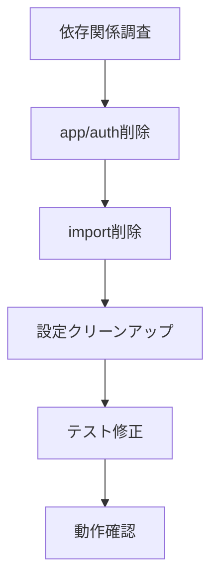
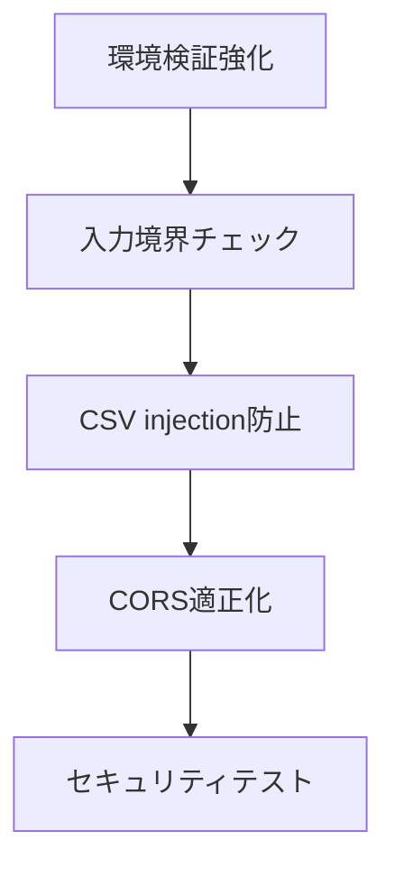

# Security Enhancement PBI Directory

## Overview

このディレクトリは、セキュリティ脆弱性評価結果に基づく**適切なセキュリティ向上PBI**を管理しています。

## 背景・発見された課題

### セキュリティ脆弱性評価による発見
2025年1月に実施したセキュリティ脆弱性評価により、以下の重要な事実が判明：

#### 🔍 **重要な発見**
1. **認証システムの実装と利用のミスマッチ**
   - 企業レベルの認証システムが完全に実装されている
   - しかし、実際のUI（index.html）では一切使用されていない
   - ユーザーは認証なしで直接コスト計算を実行している

2. **過剰なセキュリティ実装**
   - JWT認証、ユーザー登録、パスワード複雑性検証等が実装済み
   - シンプルなコスト計算ツールには不適切な複雑性
   - 不要な攻撃面の拡大

3. **実際の利用パターン**
   - **現実**: 値入力 → 計算 → 結果確認 → 終了
   - **実装**: 複雑なユーザー管理・認証システム

### セキュリティ評価結果
- **Overall Score**: B+ (7.5/10) - Good with Critical Issues
- **Critical脆弱性**: 3件（JWT、パスワード、設定関連）
- **High脆弱性**: 6件
- **主要課題**: 不要な認証システムによる攻撃面拡大

## 新しいセキュリティ方針

### 🎯 **「適切なセキュリティレベル」アプローチ**

#### 基本原則
1. **実用性重視**: 実際の用途に適したセキュリティレベル
2. **攻撃面最小化**: 不要な機能削除による根本的リスク軽減
3. **必要最小限の保護**: シンプルツールに適した基本セキュリティ

#### セキュリティ戦略
- **削除による安全化**: 複雑な認証システム完全削除
- **必須セキュリティ強化**: 残すべき機能の堅牢化
- **継続監視**: 簡素化後の適切な監視体制

## PBI Structure

```
Design/PBI/security-enhancement/
├── README.md                    # このファイル - セキュリティPBI管理
├── PBI-SEC-REFACTOR.md         # 認証システム削除PBI
└── PBI-SEC-ESSENTIAL.md        # 必須セキュリティ強化PBI
```

## PBI Details

### 🔄 **PBI-SEC-REFACTOR: セキュリティリファクタリング**
- **目的**: 不要な認証システム削除によるセキュリティ簡素化
- **見積**: 8ストーリーポイント
- **期間**: 1週間
- **優先度**: 高（セキュリティ負債解決）

#### 主要タスク
1. `app/auth/` ディレクトリ完全削除
2. JWT関連import・ミドルウェア削除
3. 認証デコレーター(@requires_auth)削除
4. ユーザーモデル・データベース削除
5. 認証関連テスト削除

#### 期待効果
- **攻撃面削減**: 70%削減
- **コードベース削減**: 30%削減
- **運用コスト削減**: 60%削減

### 🛡️ **PBI-SEC-ESSENTIAL: 必須セキュリティ強化**
- **目的**: シンプルWebツールに必要な最小限セキュリティ実装
- **見積**: 5ストーリーポイント
- **期間**: 3-4日
- **優先度**: 高（脆弱性対応）

#### 主要タスク
1. 環境変数検証強化（開発シークレット防止）
2. 入力境界チェック実装（全数値パラメータ）
3. CSV injection防止（エクスポート機能）
4. CORS設定適正化（過寛容設定修正）

#### 期待効果
- **セキュリティスコア**: B+ → A-
- **Critical脆弱性**: 100%解決
- **OWASP Top 10準拠**: 90%以上

## Implementation Plan

### Phase 1: 認証システム削除 (Week 1)


### Phase 2: 必須セキュリティ強化 (Week 2)


## Success Metrics

### セキュリティ指標
| 指標 | 現在 | 目標 | 改善率 |
|------|------|------|--------|
| セキュリティスコア | B+ (7.5) | A- (8.5) | +13% |
| Critical脆弱性 | 3件 | 0件 | -100% |
| High脆弱性 | 6件 | 1件以下 | -83% |
| 攻撃面 | 100% | 30% | -70% |

### 運用指標
| 指標 | 現在 | 目標 | 改善率 |
|------|------|------|--------|
| コードベース | 100% | 70% | -30% |
| 運用コスト | 100% | 40% | -60% |
| デプロイ時間 | 100% | 50% | -50% |
| テスト工数 | 100% | 60% | -40% |

## Related Documentation

### 移動されたPBI
- **PBI-SEC-A**: `../not-todo/PBI-SEC-A.md`
  - **移動理由**: 実装済みだが実際には使用されていない認証システム
  - **ステータス**: "実装したが利用されていない"として記録

### 参考資料
- **セキュリティ脆弱性評価報告書**: `/security-review-2025-01-26.md`
- **セキュリティアーキテクチャ**: `/ref/security-architecture.md`
- **実装ガイド**: `/ref/implementation-guide.md`

## Risk Management

### 主要リスク
1. **機能破綻リスク**: 認証依存機能の見落とし
   - **軽減策**: 徹底的な依存関係調査、段階的削除
2. **セキュリティホール**: 削除後の新たな脆弱性
   - **軽減策**: 包括的セキュリティテスト、継続監視
3. **運用影響**: 既存運用プロセスへの影響
   - **軽減策**: 運用手順書更新、ロールバック準備

### 品質保証
- **包括的テスト**: E2E、統合、単体すべてのレベル
- **セキュリティスキャン**: 削除前後での脆弱性比較
- **パフォーマンステスト**: 簡素化による性能向上確認

## Next Steps

### Immediate Actions (Week 1)
1. ✅ PBI-SEC-REFACTOR実装開始
2. ⏳ 認証システム依存関係調査
3. ⏳ 段階的削除実行

### Follow-up Actions (Week 2)
1. ⏳ PBI-SEC-ESSENTIAL実装
2. ⏳ セキュリティテスト実行
3. ⏳ 最終検証・ドキュメント更新

### Long-term Considerations
- **継続監視**: 簡素化後のセキュリティ状況
- **将来拡張**: 認証が必要になった場合の再実装方針
- **ベストプラクティス**: 適切なセキュリティレベル選択指針

---

**最終更新**: 2025-01-26  
**ステータス**: PBI作成完了 - 実装準備完了  
**次回レビュー**: 実装完了後